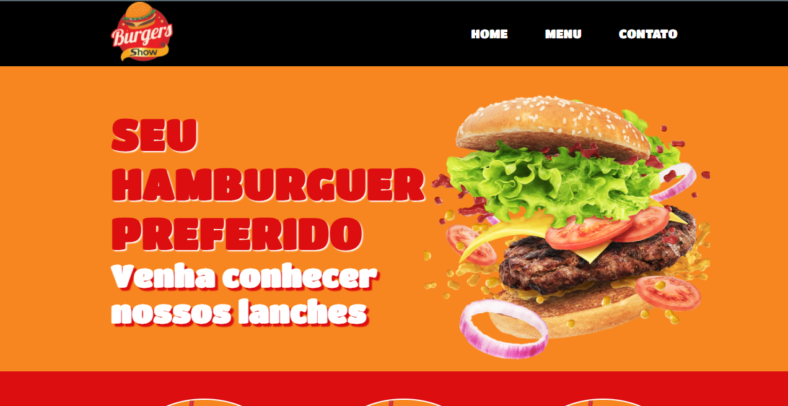

# Site Burguers Show

Este projeto foi desenvolvido para melhorar as habilidades nas tecnologias HTML 5 (semântico) e CSS 3 (flexbox). Atualmente, os programadores são Eu (Gabriel Sampaio) e o <a href="https://github.com/PabloVeronezi"> Pablo Veronezi </a>.

## Imagens

